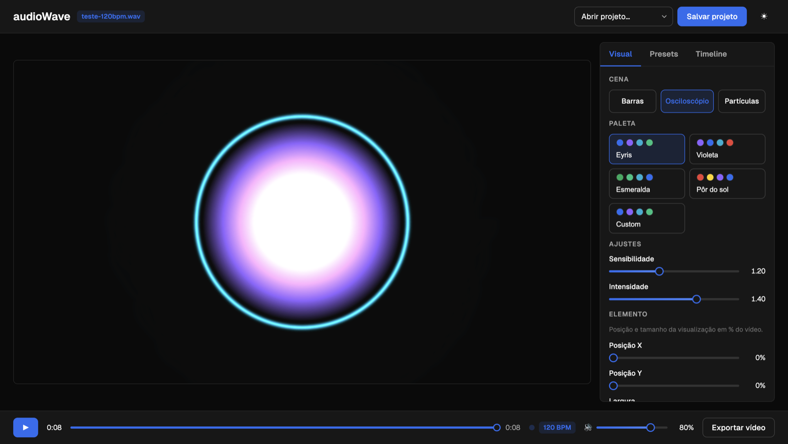
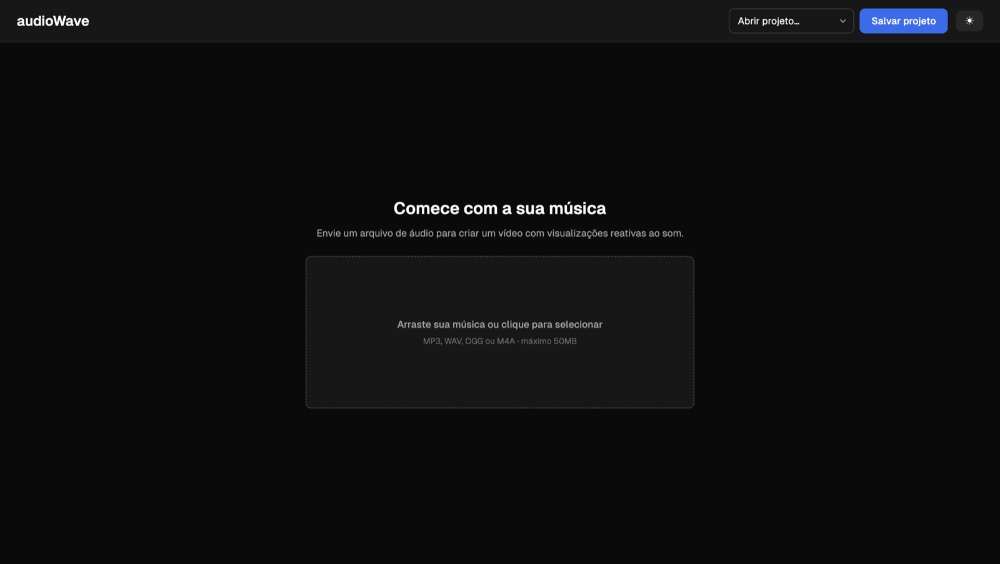
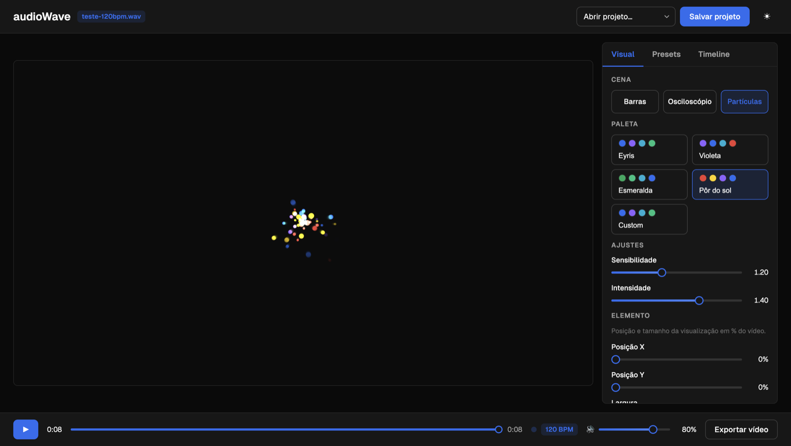
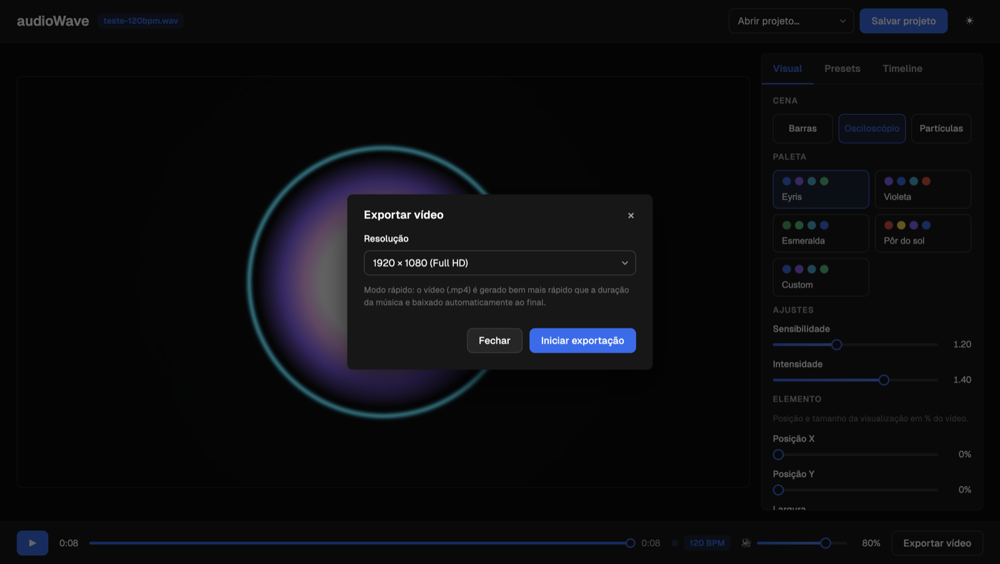

# 🎵 audioWave

**Gerador de vídeo musical no navegador.** Envie uma música, escolha visualizações
que reagem ao som em tempo real e exporte um vídeo — tudo client-side, sem enviar
seu áudio para nenhum servidor.



<p align="center">
  
  
  
  
</p>

---

## Sobre

O audioWave transforma qualquer faixa de áudio em um vídeo com **visualizações
reativas**: as barras, o osciloscópio e as partículas pulsam com as frequências,
o volume e as batidas detectadas na música. Você posiciona a visualização, escolhe
cores, adiciona uma imagem de fundo e exporta em MP4 — direto do navegador.

Toda a análise de áudio (FFT, bandas de frequência, detecção de BPM) e a
renderização acontecem **na sua máquina, dentro do browser**. O único backend é
uma API opcional que apenas guarda seus projetos.

## Métricas

| | |
|---|---|
| 🧪 **Testes** | **482** passando (381 frontend + 101 API) |
| 📦 **Bundle** | 297 KB JS (**93 KB** gzip) + 21 KB CSS |
| ⚡ **Export rápido** | 8 s de vídeo em **~2,4 s** (~3,3× mais rápido que o tempo real) |
| ⚡ **Faixa longa** | 24 min exportados em **~3 min** @720p (~7,8×) |
| 🎬 **Preview** | 60 fps · export 30 fps |
| 🎨 **Cenas / paletas** | 3 cenas · 4 paletas + paleta customizada |
| 🎧 **Formatos de entrada** | MP3, WAV, OGG, M4A (até 50 MB) |
| 📐 **Análise** | FFT 2048 · bandas 20–250 / 250–4k / 4k–16k Hz |

## Funcionalidades

- **Análise em tempo real** via Web Audio API: FFT, bandas (grave/médio/agudo),
  RMS e **detecção de beats/BPM** (algoritmo sound-energy: `média + 1.5×desvio`
  em janela de 1 s, refratário de 250 ms).
- **3 cenas** Canvas 2D reativas: **Barras**, **Osciloscópio** radial e **Partículas**.
- **4 paletas** (Eyris, Violeta, Esmeralda, Pôr do sol) + **paleta customizada**
  com cores escolhidas por você.
- **Imagem de fundo** (cover) e **imagem central** no osciloscópio (recortada em
  círculo, pulsando no beat).
- **Caixa do elemento**: posição X/Y e tamanho em % do vídeo — o preview mantém
  sempre a proporção **16:9**, idêntica ao vídeo exportado.
- **Timeline** de cenas por trecho e **presets** servidos pela API.
- **Export em dois modos:**
  - **Rápido (WebCodecs → MP4 H.264/AAC):** render offline quadro a quadro, sem
    tocar o áudio, **bem acima de 1×**.
  - **Fallback (MediaRecorder → WebM):** gravação em tempo real, para navegadores
    sem WebCodecs.
- **Projetos** salvos na API + autosave do editor no `localStorage`.
- **Dark/Light mode** sem flash e acessibilidade (focus trap, navegação por teclado).

## Exemplos

| Comece com a sua música | Partículas reativas ao beat |
|---|---|
|  |  |

| Osciloscópio radial | Exportar vídeo (MP4) |
|---|---|
|  |  |

---

## Instalação

Há duas formas de rodar o audioWave: **localmente** (com Node, ideal para
desenvolvimento) ou com **Docker** (um comando, ideal para só usar).

### Opção A — Rodando localmente (Node)

**Pré-requisito:** [Node.js](https://nodejs.org) 20+ e npm.

```bash
# 1. Clone o repositório
git clone <url-do-repo> audioWave
cd audioWave

# 2. Suba a API (terminal 1)
cd api
npm install
npm run dev            # → http://localhost:3001

# 3. Suba o frontend (terminal 2, na raiz do projeto)
cd frontend
npm install
npm run dev            # → http://localhost:5173
```

Abra **http://localhost:5173** no navegador. O editor funciona mesmo com a API
offline (só os presets e projetos salvos ficam indisponíveis).

> 💡 Há um áudio de teste em `samples/teste-120bpm.wav` para experimentar na hora.

### Opção B — Rodando com Docker

Com o Docker instalado, a aplicação inteira (frontend + API) sobe com **um comando**:

```bash
docker compose up --build      # → http://localhost:8080
```

Se a porta 8080 já estiver em uso, escolha outra:

```bash
WEB_PORT=9000 docker compose up --build   # → http://localhost:9000
```

Para parar: `Ctrl+C` e depois `docker compose down`. Seus projetos ficam salvos
no volume `audiowave-data` entre reinícios.

<sub>Nos bastidores: o **nginx** serve o frontend estático e faz proxy de `/api`
para o container da API (mesma origem, sem CORS). A API não expõe porta para o
host — fica privada na rede interna do compose.</sub>

#### Instalando o Docker

Se você ainda não tem o Docker, siga o passo a passo do seu sistema:

<details>
<summary><b>🍎 macOS</b></summary>

1. Baixe o **Docker Desktop** em <https://www.docker.com/products/docker-desktop/>
   (escolha **Apple Silicon** para Macs M1/M2/M3 ou **Intel** para os mais antigos).
2. Abra o `.dmg` e arraste o **Docker** para a pasta **Applications**.
3. Abra o Docker Desktop (ícone da baleia na barra de menu) e aguarde ficar "Running".
4. Confirme no terminal:
   ```bash
   docker --version
   docker compose version
   ```
</details>

<details>
<summary><b>🐧 Linux (Ubuntu/Debian)</b></summary>

1. Instale o Docker Engine com o script oficial:
   ```bash
   curl -fsSL https://get.docker.com | sh
   ```
2. (Opcional, recomendado) rode o Docker sem `sudo`:
   ```bash
   sudo usermod -aG docker $USER
   # saia e entre de novo na sessão para valer
   ```
3. Confirme:
   ```bash
   docker --version
   docker compose version
   ```
   > Em outras distros, veja <https://docs.docker.com/engine/install/>.
</details>

<details>
<summary><b>🪟 Windows 10/11</b></summary>

1. Ative o **WSL 2** (Windows Subsystem for Linux) — abra o PowerShell como
   administrador e rode:
   ```powershell
   wsl --install
   ```
   Reinicie o computador se for solicitado.
2. Baixe e instale o **Docker Desktop** em
   <https://www.docker.com/products/docker-desktop/> (deixe marcada a opção
   "Use WSL 2 based engine").
3. Abra o Docker Desktop e aguarde ficar "Running".
4. Confirme no **PowerShell** ou no terminal do WSL:
   ```powershell
   docker --version
   docker compose version
   ```
</details>

> **OBS:** quer entender melhor o que é Docker, imagens, containers e
> `docker compose`? Há vários canais no YouTube com ótimo conteúdo gratuito — por
> exemplo, [esta playlist de Docker do zero](https://www.youtube.com/watch?v=Wm99C_f7Kxw&list=PLf-O3X2-mxDn1VpyU2q3fuI6YYeIWp5rR).
> Não é obrigatório para rodar o projeto (os comandos acima bastam), mas ajuda
> muito se você quiser ir além.

---

## Testes

```bash
cd api && npm test          # 101 testes (rotas, schemas, repositório)
cd frontend && npm test     # 381 testes (unit + Testing Library)
npm run typecheck           # em ambos
```

## Arquitetura

```
frontend/   Vite + React 19 + TS + Zustand (porta 5173, proxy /api → 3001)
  src/audio/    motor de áudio (engine, FFT, análise, beats) — puro e testável
  src/render/   motor de render + cenas + paletas + renderer offline (export)
  src/state/    store Zustand, timeline, persistência
  src/api/      client REST tipado
  src/ui/       componentes do design system Eyris
  src/features/ composição (upload, player, visualizer, controles, export)
api/        Fastify + Zod + repository JSON (porta 3001)
```

## API

Envelope padrão `{ success, data, error }` em todas as respostas.

| Método | Rota | Descrição |
|---|---|---|
| GET | `/api/health` | healthcheck |
| GET | `/api/presets` | presets visuais (read-only) |
| GET/POST | `/api/projects` | listar / criar projeto |
| GET/PUT/DELETE | `/api/projects/:id` | ler / atualizar / remover |
